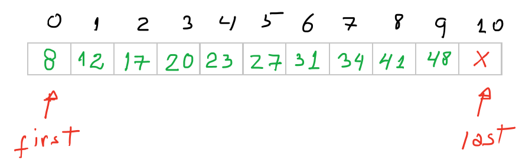

# Intro

Recently we have reviewed two traditional ways of passing an array to a **function**, so that some operation over the data may be performed.
For instance, suppose you need to print out the array content: in this case you would need to access (1) the _array_ and to know (2) which _range of elements_ you want to get printed out.

I also introduced a third way of doing the same task, based on a pair of **pointers** defining a range of interest over the array.
At first glance this third form may seen pointless (no pun intended!) and unnecessarily complicated (_why bother with pointer????_). However, we all know (or should know) that learning how to manipulate pointers is a valuable skill in the arsenal of a good programmer. Besides, most of the functions and data structure from the STL library use this same approach while passing data along to sub-routines.

So, let us experiment with this (somewhat) new way of passing arrays to function.

# The assignment 

In this assignment, we are interested in developing a function that do a [**linear search**](https://www.geeksforgeeks.org/linear-search/) over an array, looking for a given `target`.
So, the first thing you need to ask yourself is _"which information does the linear search need to run?"_.

The answer is:
1. _The array_ on which the search will be done, and
2. Some way of defining a _searching range_ over the array.

Often, the step 2 above corresponds to the entire array. However, we need to develop a versatile function that would also accommodate other cases, such as searching only on a _continuous subset_ of the array.

The second thing you need to ask is _"what information should this function return to the client?"_. This could be a boolean value, indicating the success/failure of the searching procedure, or to return the index/pointer of/to the `target` element if this element is present in the array. In case the element is no there in the array, the function may return a _negative index_ or a _null pointer_, depending on the implementation approach choosen.

# Three ways of passing array to a function

In this section I review distinct approaches to provide the two pieces of information our linear search "_black box_" requires to work: _the array_ and _the searching range_.

The **first way** of passing an array to our function presented today was:

```c++
int lsearch( int A[], size_t n, int target );
```
where `A` is the pointer to the beginning of the array, `n` is the array length, and `target` is the value we are searching for.[^1]
[^1]: I'm not using `value_type` in these examples, to make the code simpler to understand.

Note that in this approach, the _searching range_ is (implicitily) "locked" to always run from the beginning of the array, and may or may not traverse the entire array, depending on the value of `n` provided.

The client code could be something like

```c++
int main() {
    int V[]{ 9, 2, 1, 4, -2, 0, 5, 12 }; // The data array.
    size_t n = sizeof(data)/sizeof(int); // Find out the array length.

    int target{ -2 };// The target we are looking for.

    // ===== Execute the linear search on the entire array.
    int idx = lsearch( V, n, target );
    // =====

    // Evaluate the result.
    if ( idx == -1 ) std::cout << "Could no find target!\n";
    else std::cout << "Find target at " << idx << "\n";

    return 0;
}
```

The **second way** requires two indices, corresponding to the range we want to consider. Recall that in this case, the two indices `left` and `right` define a closed-closed interval [`left`,`right`], which means both ends of the range must be considered in the searching process.

```c++
int lsearch2( int A[], size_t left, size_t right, int target );
```
where `left` is the index of the first element in the searching range, and `right` is the index of the element in the searching range (inclusive).

The corresponding call on the client side could be

```c++
int main() {
    // ... same as before

    // ===== Execute the linear search on the entire array.
    int idx = lsearch2( V, 0, n-1, target );  // Notice that we pass (n-1) and not n. Do you know why?
    // =====

    // ... same as before.
}
```

But now, the second version of the function may support a search on a fragment of the array, as in

```c++
int main() {
    // ... same as before

    // ===== Execute the linear search on part of the array.
    int idx = lsearch2( V, 1, n-2, target ); // Looking into V[1], V[2],...V[n-2]
    // =====

    // ... same as before.
}
```

The **third way** of doing the same task is to pass on two pointers: one, usually called `first`, to the beginning of the range you which to search for (or do any other task for that matter), and another called `last` that points to a position _just past the last element you which to consider_. Beware that the element that `last` points to _should not be considered_ and it may even point to a location (just) "outside" the valid array, in the particular case we would need to process the entire array.




In the latter case (processing the entire array), if you unintentionally try to dereference the `last` pointer you will trigger the classical [_segmentation fault_](https://en.wikipedia.org/wiki/Segmentation_fault).

Check out below the corresponding code for this interesting approach

```c++
int* lsearch3( int *first, int *last, int target );
```
The corresponding call on the client code side would be

```c++
int main() {
    // ... same as before

    // ===== Execute the linear search on the entire array.
    int* result = lsearch3( V, V+n, target );
    // =====

    // Evaluate the searching's outcome.
    if ( result == nullptr ) std::cout << "Sorry, could no find target!\n";
    else std::cout << "Find target at position " << (result-V) << " in the array.\n";

    return 0;
}
```

Note that the return of the function `lsearch3()` is different from the previous versions.
In this new version you should return _a pointer_  to the element you are looking for if it is present in the array, or `nullptr` if the element is not present in the array.

Because `result` is a pointer (i.e. it just holds an address), we need to do some [_pointer arithmetic_](https://www.learncpp.com/cpp-tutorial/6-8a-pointer-arithmetic-and-array-indexing/)  to determine the index or the location of the target. Hence the `(result-V)`.

# The challenge

Your challenge is

1. Complete the code for the linear searching using the third approach;
2. Implement the `print(int *first, int *last)` function that, as the name implies, prints out the content of a range of elements in the array.
3. Try out your new function with different test-cases, to make sure it really works.

The starting code for this assignment may be found [here](src/driver_lsearch.cpp).

To compile and run the code provided from the root folder of this project, type the commands below followed by an enter:

1. `mkdir build`
2. `g++ -Wall -std=c++11 src/driver_lsearch.cpp -o build/dls`
3. `./build/dls`

Good work!

===================================================================================================================

Tradução completa.

# Introdução

Recentemente, revisamos duas maneiras tradicionais de passar um array para uma função **, para que alguma operação sobre os dados possa ser realizada.
Por exemplo, suponha que você precise imprimir o conteúdo da matriz: nesse caso, você precisaria acessar (1) a matriz _ e saber (2) qual o _ intervalo de elementos_ que você deseja imprimir.

Também introduzi uma terceira maneira de fazer a mesma tarefa, com base em um par de ** ponteiros ** que definem um intervalo de interesse sobre a matriz.
À primeira vista, essa terceira forma pode ser inútil (sem trocadilhos!) E desnecessariamente complicada (por que se preocupar com o ponteiro ???? _). No entanto, todos sabemos (ou devemos saber) que aprender a manipular ponteiros é uma habilidade valiosa no arsenal de um bom programador. Além disso, a maioria das funções e estrutura de dados da biblioteca STL usa essa mesma abordagem ao passar dados para as sub-rotinas.

Então, vamos experimentar com esta (um pouco) nova maneira de passar matrizes para funcionar.

# A atribuição

Nesta tarefa, estamos interessados ​​em desenvolver uma função que faça uma [** pesquisa linear **] (https://www.geeksforgeeks.org/linear-search/) sobre uma matriz, procurando por um determinado `alvo '.
Então, a primeira coisa que você precisa se perguntar é _ "quais informações a pesquisa linear precisa executar?" _.

A resposta é:
1. _A matriz_ na qual a pesquisa será feita e
2. Alguma maneira de definir um _ intervalo de pesquisa_ sobre a matriz.

Freqüentemente, a etapa 2 acima corresponde a toda a matriz. No entanto, precisamos desenvolver uma função versátil que também acomode outros casos, como pesquisar apenas em um subconjunto contínuo da matriz.

A segunda coisa que você precisa perguntar é _ "quais informações essa função deve retornar ao cliente?" _. Pode ser um valor booleano, indicando o sucesso / falha do procedimento de pesquisa, ou para retornar o índice / ponteiro de / para o elemento `target` se esse elemento estiver presente na matriz. Caso o elemento não exista na matriz, a função pode retornar um _negative index_ ou um _null pointer_, dependendo da abordagem de implementação escolhida.

# Três maneiras de passar array para uma função

Nesta seção, reviso abordagens distintas para fornecer as duas informações necessárias para que nossa pesquisa linear "caixa preta" funcione: _a matriz_ e _o intervalo de pesquisa_.

A ** primeira maneira ** de passar uma matriz para nossa função apresentada hoje foi:

`` c ++
int lsearch (int A [], size_t n, int target);
`` ``
onde `A` é o ponteiro para o início da matriz,` n` é o comprimento da matriz e `target` é o valor que estamos procurando. [^ 1]
[^ 1]: Eu não estou usando o `value_type` nestes exemplos, para tornar o código mais simples de entender.

Observe que, nesta abordagem, o _searching range_ é (implicitamente) "bloqueado" para sempre ser executado desde o início da matriz, e pode ou não atravessar a matriz inteira, dependendo do valor de `n` fornecido.

O código do cliente pode ser algo como

`` c ++
int main () {
    int V [] {9, 2, 1, 4, -2, 0, 5, 12}; // A matriz de dados.
    size_t n = sizeof (dados) / sizeof (int); // Descubra o comprimento do array.

    int target {-2}; // O alvo que estamos procurando.

    // ===== Execute a pesquisa linear em toda a matriz.
    int idx = lsearch (V, n, alvo);
    // =====

    // Avalie o resultado.
    if (idx == -1) std :: cout << "Não foi possível encontrar o destino! \ n";
    else std :: cout << "Encontre o destino em" << idx << "\ n";

    retornar 0;
}
`` ``

A ** segunda via ** requer dois índices, correspondentes ao intervalo que queremos considerar. Lembre-se de que, neste caso, os dois índices `left` e` right` definem um intervalo fechado-fechado [left], `right`], o que significa que ambas as extremidades do intervalo devem ser consideradas no processo de busca.

`` c ++
int lsearch2 (int A [], tamanho_t à esquerda, tamanho_t à direita, int target);
`` ``
onde `left` é o índice do primeiro elemento no intervalo de pesquisa e` right` é o índice do elemento no intervalo de pesquisa (inclusive).

A chamada correspondente no lado do cliente pode ser

`` c ++
int main () {
    // ... o mesmo de antes

    // ===== Execute a pesquisa linear em toda a matriz.
    int idx = lsearch2 (V, 0, n-1, alvo); // Observe que passamos (n-1) e não n. Você sabe por quê?
    // =====

    // ... o mesmo de antes.
}
`` ``

Mas agora, a segunda versão da função pode suportar uma pesquisa em um fragmento da matriz, como em

`` c ++
int main () {
    // ... o mesmo de antes

    // ===== Execute a pesquisa linear em parte da matriz.
    int idx = lsearch2 (V, 1, n-2, alvo); // Analisando V [1], V [2], ... V [n-2]
    // =====

    // ... o mesmo de antes.
}
`` ``

A ** terceira maneira ** de fazer a mesma tarefa é passar dois ponteiros: um, geralmente chamado de `primeiro`, para o início do intervalo que você deseja procurar (ou executar qualquer outra tarefa nesse sentido) e outro chamado `last 'que aponta para uma posição _ logo após o último elemento que você deve considerar_. Lembre-se de que o elemento que `last` aponta para _ não deve ser considerado_ e pode até apontar para um local (apenas)" fora "da matriz válida, no caso específico


No último caso (processando toda a matriz), se você tentar desreferenciar acidentalmente o ponteiro `last`, acionará a clássica [_segmentation fault_] (https://en.wikipedia.org/wiki/Segmentation_fault).

Confira abaixo o código correspondente para esta abordagem interessante

`` c ++
int * lsearch3 (int * primeiro, int * último, int destino);
`` ``
A chamada correspondente no lado do código do cliente seria

`` c ++
int main () {
    // ... o mesmo de antes

    // ===== Execute a pesquisa linear em toda a matriz.
    int * resultado = lsearch3 (V, V + n, alvo);
    // =====

    // Avalie o resultado da pesquisa.
    if (result == nullptr) std :: cout << "Desculpe, não foi possível encontrar o destino! \ n";
    else std :: cout << "Localizar destino na posição" << (resultado-V) << "na matriz. \ n";

    retornar 0;
}
`` ``

Note que o retorno da função `lsearch3 ()` é diferente das versões anteriores.
Nesta nova versão, você deve retornar _a ponteiro_ para o elemento que procura, se estiver presente na matriz, ou `nullptr` se o elemento não estiver presente na matriz.

Como `result` é um ponteiro (isto é, apenas contém um endereço), precisamos fazer algumas [_pointer arithmetic_] (https://www.learncpp.com/cpp-tutorial/6-8a-pointer-arithmetic-and- indexação de matriz /) para determinar o índice ou a localização do destino. Daí o `(resultado-V)`.

# O desafio

Seu desafio é

1. Complete o código para a pesquisa linear usando a terceira abordagem;
2. Implemente a função `print (int * primeiro, int * último)` que, como o nome indica, imprime o conteúdo de um intervalo de elementos na matriz.
3. Experimente sua nova função com diferentes casos de teste, para garantir que ela realmente funcione.

O código inicial para esta tarefa pode ser encontrado [aqui] (src / driver_lsearch.cpp).

Para compilar e executar o código fornecido a partir da pasta raiz deste projeto, digite os comandos abaixo seguidos de um enter:

1. `mkdir build`
2. `g ++ -Wall -std = c ++ 11 src / driver_lsearch.cpp -o build / dls`
3. `. / Build / dls`

Bom trabalho!

